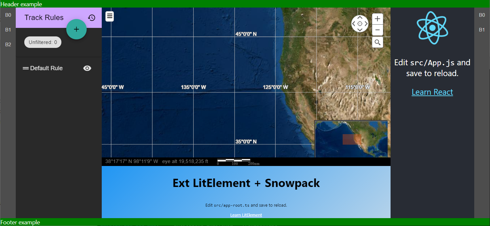
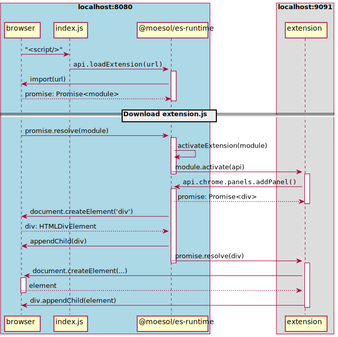

# Extension Scaffold (ES)

ES is designed to be a lightweight alternative to OWF.
The extension design concept comes from opensource tools such as Eclipse, VSCode, and Theia.
However, code from the above projects was not directly utilized
in an attempt to make a small and understandable implementation.

One of the major differences between OWF and `ES` is that OWF uses `iframes` to isolate each widget;
while, `ES` uses JavaScript `modules` to mostly isolate JavaScript code,
and HTML5 Shadow DOM to mostly isolate unwanted CSS interactions.
Extensions are free to use `iframes` to create a stronger barrier between extensions,
but currently `ES` does not aid (or hinder) the use of `iframes`.
In order to quickly port the `display-rule` and `aeolus` examples `iframes` were used.
Without them, the location of relative assets would need to be updated, since
all requests are relative to the "hosting" page.
Non-`iframe` extensions can be served from outside the "Same Origin" as the "hosting" webpage
since the browser JavaScript module loader allows this.

> Note: A known downside to using an `iframe`, is a re-initialization "flicker/flash" effect
> that happens if an `iframe` is removed from the DOM and added back to the DOM.
> When a panel containing and `iframe` is "popped-out" into its own top-level window,
> or "popped-in" to a panel, it *will* trigger the browser re-initialization behavior.

Below is a screenshot of a "hosting" page and several extensions loaded:



## Getting Started

`ES` is delivered as a NPM module.
Create a "hosting" single page application (SPA), and bundle `@gots/es-runtime`, with your SPA.
When creating a new "hosting" SPA, follow the instructions for the bundler you want to use to setup
a simple SPA.
Install `es-runtime` locally using:

```shell
npm install -D @gots/es-runtime
```

The `es-application-examples/es-demo` folder contains an example "hosting" SPA 
that is based the `snowpack` bundler and the `typescript` language.

The "hosting" webpage should contain a root element, similar to a React application.

```html
<div id="grid-container"></div>
```

Your "hosting" webpage will call the `boot` method to connect the grid layout it manages to the root element. 
After calling `boot` it will call `loadExtension` one or more times to load extensions from one or more web servers.

```typescript
import { extensionScaffold } from '@gots/es-runtime/build/es-api'

async function loadExtensions() {
  extensionScaffold.boot(document.getElementById('demo-grid-container'))
  
  await extensionScaffold.loadExtension('http://localhost:9091/dist/ext-react-snowpack.js')
  await extensionScaffold.loadExtension('http://localhost:9092/ext-react-rollup.js')
  await extensionScaffold.loadExtension('http://localhost:5000/build/ext-svelte-rollup.js')
  await extensionScaffold.loadExtension('http://localhost:9093/ext-react-webpack.js')
  await extensionScaffold.loadExtension('http://localhost:9094/dist/ext-lit-element.js')
}

loadExtensions()
```

Each extension should be a JavaScript module which exports a single function named `activate`.
When using typescript, `activate` should be declared using the syntax:

```typescript
import { extensionScaffold } from '@gots/es-runtime/build/es-api'

// .. declare the activate function

export async function activate(scaffold: ExtensionScaffoldApi) { ... }
```


Once the browser has downloaded (or loaded from cache) the JavaScript module,
the `es-runtime` will call the exported `activate` method.

During the `activate` call extensions can use the `ExtensionScaffoldApi`
to add, remove, show, hide, maximize, and minimize panels.
> NOTE: Each panel that is added with `addPanel` must have a unique ID.

The panel layout is managed using a grid layout.


## Sequence Diagram for an Extension Adding Panel



## Multiple Panels in the same Location

The `left-bar` and `right-bar` are currently reserved for the `es-runtime`.
The `left-bar` panel contains buttons that control which `left` panel is currently shown.
Similarly the `right-bar` panel controls which `right` panel is shown.
When more than one panel is added to the `left` or `right` location, the one added first
is shown (TODO - API to control order of buttons and which panel is shown by default).
The other panels are hidden (using style `display: none`) until the `showPanel` API is called
with the ID matching the hidden panel.

The `center`, `top`, and `bottom` panels will stack.
The last panel added or the last panel shown with `showPanel` will be displayed.
All other panels will be hidden (using style `display: none`).
If `removePanel` is called on the currently shown panel, the next panel in the "stack"
will be shown automatically. 

## Floating panels over the center

The example in `es-extension-examples/ext-example-snowpack/src/Ribbon.tsx` shows how to create a floating ribbon bar. 
When adding to the `portal` location, the child element can use 

```
    position: absolute;
```

* `top: 0px` is located to the bottom of the top grid area.
* `bottom: 0px` is located to the top of the bottom grid area.
* `left: 0px` is located to the right of the left panel area (which moves to the left-bar when left panel is hidden)
* `right: 0px` is located to the left of the right panel area (which moves to the right-bar when right panel is hidden)

Using the `portal` panel location you can pop panels over the `center` grid area 
and place them along any of its borders.
> Note: Since these `portal` panels will cover part of the `center` panel
> you should provide the user a way to close them.

# Directory Layout

## `compose`

A docker compose environment that starts the demo 
using the `es-demo` and `es-runtime` and starts the example extensions.
This is primarily for developing the `extension-scaffold`.
`es-demo` is running at `http://localhost:8080`.
`es-runtime` is running at `http://localhost:8081`.

See [compose/README.md](compose/README.md) for more information.

## `es-runtime`

Typescript definition of Extension Scaffold API.
The Extension Scaffold runtime. 
It will load the extensions and expose the API to the loaded extensions.
The API allows the extensions to create panels.

## `es-extension-examples`

Contains sub-directories with extensions written with snowpack, rollup, webpack, etc.

# Extension Examples

The examples show how to use different frameworks/bundlers to create an extension.

# Developing `es-runtime`

After making a change to the runtime, `http://localhost:8081` should update via *hot-module-replacement*.
If not, refresh the browser.

Testing the same changes for `es-demo`, requires updating `es-demo/node_modules/@gots/es-runtime`
in such a way that `snowpack` will re-bundle `es-runtime`.
To do this follows these five steps:
1) Change `es-runtime/package.json` **version**. For example change `0.2.0-build-1` to `0.2.0-build-2`
2) In same folder (`es-runtime`) run:
   ```
   npm pack
   ```
   This will generate a new `.tgz` file: `es-runtime/gots-es-runtime-{version}.tgz`
3) In `es-demo` folder install new `.tgz` based npm package using
   `npm i ../../es-runtime/gots-es-runtime-{version}.tgz`<br/>
    For the example **version** above run:
    ```
    npm i ../../es-runtime/gots-es-runtime-0.2.0-build-2.tgz
    ```
4) Restart `es-demo` docker container, use UI, or use shell
   ```
   cd compose
   docker-compose restart es-demo
   ```
5) Refresh browser
