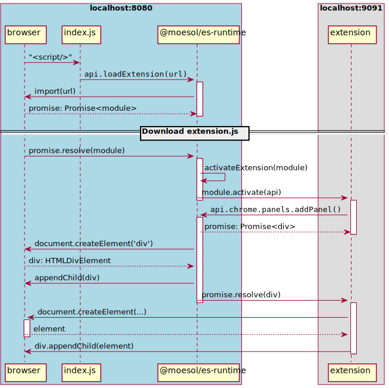

# Extensions

Each extension should be a JavaScript module which exports a single function named `activate`.
When using typescript, `activate` should be declared using the syntax:

```typescript
import type { ExtensionScaffoldApi } from '@gots/es-runtime/build/es-api'

// .. declare the activate function

export async function activate(scaffold: ExtensionScaffoldApi, baseUrl: string) { ... }
```

Once the browser has downloaded (or loaded from cache) the JavaScript module,
the `es-runtime` will call the exported `activate` method.

During the `activate` call extensions can use the `ExtensionScaffoldApi`
to add, remove, show, hide, maximize, and minimize panels.
> NOTE: Each panel that is added with `addPanel` must have a unique ID.

The panel layout is managed using a grid layout.


## Sequence Diagram for an Extension Adding Panel


