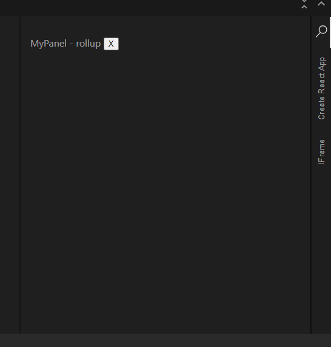
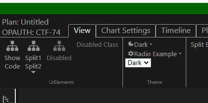

# Getting Started

The main page for `ES` is `es-home`, a data-driven hosting page.
While it is data driven, it currently avoids the requirement to have a dynamic server side component,
such as `JBoss` or `nodejs`.
Instead it uses simple JSON files that can be served from any static web server such as Apache `httpd`.
Currently the deployment plan is to deploy `es-home` under the `/ui/es` URL.

> Note: GCCS-M chose to use `/es-home`

At startup `es-home` loads the resource `./apps/index.json` (resolves to `/ui/es/apps/index.json`).
For ONR integration purposes this file is volume mounted from `/opt/extension-scaffold/apps/`.
When the user clicks a button for an application, the `name` "slug" in the `index.json`
is appended to the URL as a fragment location (`#` hash).
For example, if the user clicks on BGO, then `es-home` navigates to `/ui/es/#bgo`.
This URL can be bookmarked for direct traversal.

When a `#bgo` is in the URL, `es-home` fetches the `./apps/bgo.json` file which defines
the ribbon, panel, and iframe URLs to pull into `ES`.
To make these files easier to build, there is a set of files in source code
under `data/applications`, and `data/extensions`.
During `rush build` these files are cross referenced to convert IDs
into the list of `extensions` that are defined to provide those IDs.
Also, `index.json` is generated.

## Adding a Left Panel from an Extension

The example in `es-extension-examples/ext-example-rollup` is
an extension that adds a simple Left Panel.
You can copy this directory to create your first extension.
Change the port the project will run onto to `9100`:

Edit `rollup.config.js` and change `9092` to `9100`:

```js
        process.env.DO_SERVE && serve({
            port: 9100,
            contentBase: 'build',
            headers: {
                'Access-Control-Allow-Origin': '*',
            },
        }),
```

Then add your extension to `es-home/public/apps/example.json`:

```json
  "extensions": [
    "/ui/ext-example-snowpack/dist/ext-react-snowpack.js",
    "/es/common/dist/theme-extension.js",
    "/es/ui/dist/extensions/console-extension.js",
    "/es/ui/dist/extensions/network-extension.js",
    "/es/common/dist/debug-metrics.js",
    "/es/ui/dist/extensions/help-about-extension.js",
    "http://localhost:9091/dist/ext-react-snowpack.js",
    "http://localhost:9092/ext-react-rollup.js",
    "http://localhost:9093/ext-react-webpack.js",
    "http://localhost:9094/dist/ext-lit-element.js",

    "http://localhost:9100/ext-react-rollup.js",
  ],
```

This section of `es-extension-examples/ext-example-rollup/rollup.config.js` 
builds the ESM formatted JavaScript module required by Extension Scaffold:

```
export default {
    input: 'src/extension-entry.tsx',
    output: {
        file: 'build/ext-react-rollup.js',
        format: 'es'
    },

```

From above, you can see the input to rollup starts from 
`es-extension-examples/ext-example-rollup/src/extension-entry.tsx`.
Below is the contents of `extension-entry.tsx`.

```ts
import * as ReactDOM from 'react-dom';
import * as React from 'react';
import { MyPanel } from './MyPanel';
import type { ExtensionScaffoldApi } from '@gots/es-runtime/build/es-api'

export async function activate(scaffold: ExtensionScaffoldApi, baseurl: string) {
  function onPanelAdded(div: HTMLDivElement) {
    ReactDOM.render(
      <React.StrictMode>
        <MyPanel es={scaffold} />
      </React.StrictMode>,
      div
    );
  }

  const span = document.createElement('span')
  const svg = <svg className="use-fill" preserveAspectRatio="xMidYMid meet" viewBox="0 0 24 24">
    <path d="M15.25 0a8.25 8.25 0 0 0-6.18 13.72L1 22.88l1.12 1l8.05-9.12A8.251 8.251 0 1 0 15.25.01V0zm0 15a6.75 6.75 0 1 1 0-13.5a6.75 6.75 0 0 1 0 13.5z" />
  </svg>
  ReactDOM.render(svg, span)

  scaffold.chrome.panels.addPanel({
    id: 'ext.example.rollup',
    title: 'Rollup Left',
    icon: span,
    location: 'left',
    resizeHandle: true,
    removeButton: true,
  }).then(onPanelAdded)
}
```

JavaScript module based extensions must export an `activate(api, baseurl)` function.
The Extension Scaffold will call `activate` once it imports the module.
Next, the extension calls `scaffold.chrome.panels.addPanel`.
For your getting started copy,
you **must** change the `id` from `ext.example.rollup` to something unique.
For example: `your-organization.getting-started.left`.

When the `addPanel` promise resolves to provide a `HTMLDivElement` the `onPanelAdded` function is called.
In this example, the `onPanelAdded` function shows how a React component can be rendered into the `div`.



In the screenshot above, the `example.json` contains the settings below, which forces the panel to the right.

```json
{
  ...
  "right": [
    "ext.example.rollup",
    ...
  ],
```

* Also see _Dynamically Adding and Removing a Left Panel_ below.

## Adding a Ribbon Tab

Ribbon tabs are declared in the applications JSON file.
For examples of tab declarations see `es-home/public/apps/example.json`:

```json
{
  "ribbon": [
    ...
    {
      "tab": "View",
      "sections": [
        "view.section1",
        "display.theme",
        "view.split.button"
      ]
    },
```

Each section needs to be "claimed" by an extension which can then
populate the controls in the ribbon tab section.
For an example of calling `scaffold.chrome.ribbonBar.claimRibbonPanel` and 
an example implementation for the `display.theme` section ,
see `es-common-extensions/src/theme-extension.tsx`

```
import React from 'react';
import ReactDOM from 'react-dom';
import type { ExtensionScaffoldApi } from '@gots/es-runtime/build/es-api'
import { ThemeSelect } from './ThemeSelect';

/**
 * Helper functions to avoid if (div === null) broiler plate.
 */
function claimRibbonThen(scaffold: ExtensionScaffoldApi, id: string, f: (div: HTMLDivElement) => void) {
  const div = scaffold.chrome.ribbonBar.claimRibbonPanel(id)
  if (div === null) {
    console.error('ribbon panel not found', id)
    return
  }
  f(div)
}

function claimRibbonWith(scaffold: ExtensionScaffoldApi, id: string, node: React.ReactNode) {
  claimRibbonThen(scaffold, id, div => {
    ReactDOM.render(<React.StrictMode>{node}</React.StrictMode>,div)
  })
}
  
export let activatedAtUrl = ''
export async function activate(scaffold: ExtensionScaffoldApi, url: string) {
  activatedAtUrl = url

  claimRibbonWith(scaffold, 'display.theme', 
    <ThemeSelect container={ scaffold.gridContainer}/>
  )
}
```



## Dynamically Adding and Removing a Modeless Panel

File: `es-extension-examples/ext-example-snowpack/src/ext-react-snowpack.tsx`

```ts
export function addModelessPanel(scaffold: ExtensionScaffoldApi, esId: string) {
  function onPanelAdded(div: HTMLDivElement) {
    ReactDOM.render(
      <React.StrictMode>
        <MyModeless es={scaffold} esId={esId} />
      </React.StrictMode>,
      div
    );
    claimStyleFromHeadElement(div, '#ext.example.snowpack')
  }
  scaffold.chrome.panels.addPanel({
    id: esId,
    location: 'modeless',
    resizeHandle: false,
  }).then(onPanelAdded).catch(() => {
    scaffold.chrome.panels.showPanel(esId)
  })
}
```

File: `es-extension-examples/ext-example-snowpack/src/Left.tsx`

```ts
import { addModelessPanel } from './ext-react-snowpack'

    function handleModelessDialog() {
        addModelessPanel(es, 'ext.example.snowpack.modeless')
    }
```

```jsx
        <div>
            <button onClick={handleModelessDialog}>Modeless Dialog</button>
        </div>
```

## Adding a Panel from an IFrame

```json
  "iframes": [
    {
      "id": "es.example.iframe",
      "title": "IFrame",
      "location": "right",
      "iframeSource": "http://localhost:9095/",
      "resizeHandle": true,
      "removeButton": true
    }
  ]
```

## Inter-Widget Communication (IWC)

From the first page/iframe:
```ts
import { initialize, subscribeJson } from '@gots/noowf-inter-widget-communication';

    initialize({
        search: window.location.search
    })
    subscribeJson('es.ping.topic', (sender, message, topic) => {
      console.log(sender, message, topic)
    })
```

From another page/iframe:
```ts
import { initialize, publishJson } from '@gots/noowf-inter-widget-communication';

    initialize({
        search: window.location.search
    })
    publishJson('es.ping.topic', {
      message: "Hello World"
    })
```

* See more IWC details - https://www.trmc.osd.mil/bitbucket/projects/MINERVA/repos/inter-widget-communication/browse

## Map IWC API

This is a thin typescript wrapper that tries to capture the message names and the message payload types.

* See typescript definitions for the map IWC messages -
  https://www.trmc.osd.mil/bitbucket/projects/MINERVA/repos/map-iwc-api/browse