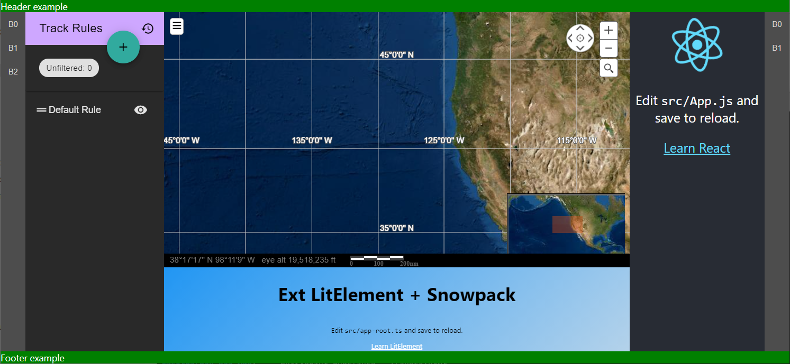

# Extension Scaffold (ES)

A lightweight alternative to OWF.

The extension design concept comes from opensource tools such as Eclipse, VSCode, and Theia.
However, code from the above projects was not directly utilized
in an attempt to make a small and understandable implementation.

While OWF uses `iframes` to isolate each widget,
`ES` offers three modes of isolation:

1. Panels are wrapped in HTML5 `Shadow DOM` nodes:
   `Shadow DOM` prevents unwanted CSS interactions, but takes additional steps
   with most frameworks to "pull" the CSS into the `Shadow DOM`
2. JavaScript `modules`:
   With `modules` global varibles are `module` scoped. However, changes on the `window` object
   are visible to all `modules`.
3. `iframes` are also supported:
   The easiest way to move a wiget from OWF to ES is to use an `iframe` based panel.

As with OWF the design of ES assumes the heavy use of "inter-widget communication" (IWC).
However, ES does not provide the IWC implementation.
Instead, ES expects extensions to use the NPM module `@moesol/inter-widget-communication`.

In order to quickly port the `display-rule` example `iframes` were used.
Without them, the location of relative assets would need to be updated, 
since all requests are relative to the "hosting" page (`es-home`).
Non-`iframe` extensions can be served from outside the "Same Origin" as the "hosting" webpage
since the browser JavaScript module loader allows this (with proper `CORS` headers).

> Note: A known downside to using an `iframe`, is a re-initialization "flicker/flash" effect
> that happens if an `iframe` is removed from the DOM and added back to the DOM.
> When a panel containing and `iframe` is "popped-out" into its own top-level window,
> or "popped-in" to a panel, it *will* trigger this browser re-initialization behavior.

Below is a screenshot of a "hosting" page and several extensions loaded:

