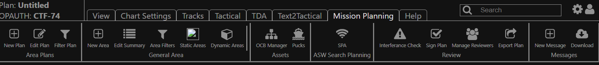
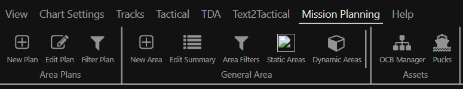

# BGO Ribbon

Ribbon bar library and implementation for use in BGO-UI.

# Examples

## Simple Ribbon

```js
    import { SimpleRibbon } from '@gots/bgo-ribbon //todo need to publish'

    <SimpleRibbon
        plan="Untitled"
        opauth="CTF-74"
        onSettingsClick={() => console.log('settings clicked')}
        onUserClick={() => console.log('user clicked')}
        labels={[
            'View',
            'Chart Settings',
            'Tracks',
            'Tactical',
            'TDA',
            'Text2Tactical',
            'Mission Planning',
            'Help']}
    >
        <div>View (TODO SEE MISSION PLANNING)</div>
        <div>Chart Settings (TODO SEE MISSION PLANNING)</div>
        <div> Tracks (TODO SEE MISSION PLANNING)</div>
        <div>Tactical (TODO SEE MISSION PLANNING)</div>
        <div>TDA (TODO SEE MISSION PLANNING)</div>
        <div>Text2Tactical (TODO SEE MISSION PLANNING)</div>
        <MissionPlanning />
        <div>Help (TODO SEE MISSION PLANNING)</div>
    </SimpleRibbon>

```



## File System Ribbon

```js
    import { FileRibbon as Ribbon } from '@gots/bgo-ribbon  // TODO PUBLISH LIB'

    <Ribbon
        labels={[
            'View',
            'Chart Settings',
            'Tracks',
            'Tactical',
            'TDA',
            'Text2Tactical',
            'Mission Planning',
            'Help']}>
        <Content label='View'/>
        <Content label='Chart Settings'/>
        <Content label='Tracks'/>
        <Content label='Tactical'/>
        <Content label='TDA'/>
        <Content label='Text2Tactical'/>
        <MissionPlanning />
        <Content label='Help'/>
    </Ribbon>

```



## Custom Ribbon

TODO: DOCS


## Menu Content

Note: For each Ribbon (File or Regular) menu content is passed as React components and read as an array. For every label (passed in as labels array) you must pass a react child node to correspond to that tab section. Each section can be w/e is desired for content but this library comes bundled with a helper menu system as pictured above. Here is the example code fo the tab section MissionPlanning displayed in the above images.

```js
import React from 'react'
import { MenuSection, MenuButton, VerticalDivider } from '@gots/bgo-ribbon //TODO: NEED TO PUBLISH LIB'


export const MissionPlanning: React.FC = () => {
    const onClick = () => console.log('menu button clicked: TODO')

    return (
        <>
            <MenuSection name="Area Plans">
                <MenuButton name="New Plan" svgUrl="/static/icons/plus-square-o.svg" onClick={onClick} />
                <MenuButton name="Edit Plan" svgUrl="/static/icons/pencil-square-o.svg" onClick={onClick} />
                <MenuButton name="Filter Plan" svgUrl="/static/icons/filter.svg" onClick={onClick} />
            </MenuSection>
            <MenuSection name="General Area">
                <MenuButton name="New Area" svgUrl="/static/icons/plus-square-o.svg" onClick={onClick} />
                <MenuButton name="Edit Summary" svgUrl="/static/icons/list.svg" onClick={onClick} />
                <MenuButton name="Area Filters" svgUrl="/static/icons/filter.svg" onClick={onClick} />
                <MenuButton name="Static Areas" svgUrl="" onClick={onClick} />
                <MenuButton name="Dynamic Areas" svgUrl="/static/icons/cube.svg" onClick={onClick} />
                <VerticalDivider />
            </MenuSection>
            <MenuSection name="Assets">
                <MenuButton name="OCB Manager" svgUrl="/static/icons/sitemap.svg" onClick={onClick} />
                <MenuButton name="Pucks" svgUrl="/static/icons/ship.svg" onClick={onClick} />
            </MenuSection>
            <MenuSection name="ASW Search Planning">
                <MenuButton name="SPA" svgUrl="/static/icons/wifi.svg" onClick={onClick} />
            </MenuSection>
            <MenuSection name="Review">
                <MenuButton name="Interferance Check" svgUrl="/static/icons/exclamation-triangle.svg" onClick={onClick} />
                <MenuButton name="Sign Plan" svgUrl="/static/icons/check-square-o.svg" onClick={onClick} />
                <MenuButton name="Manage Reviewers" svgUrl="/static/icons/users.svg" onClick={onClick} />
                <MenuButton name="Export Plan" svgUrl="/static/icons/share-square-o.svg" onClick={onClick} />
            </MenuSection>
            <MenuSection name="Messages">
                <MenuButton name="New Message" svgUrl="/static/icons/plus-square-o.svg" onClick={onClick} />
                <MenuButton name="Download" svgUrl="/static/icons/cloud-download.svg" onClick={onClick} />
            </MenuSection>
        </>
    )
}

```

# Styling

Within extension skaffold each plugin is within a shadow-dom which causes problems with bundling styles currently
importing and injecting the style within a <style> tag to avoid lost styling when hoisted to head of document but within
a shadow-dom node. Usage outside of extension-skaffold environment that is not within a shadow-dom may use traditional style
hoisting. TODO: Include a copy/paste of ribbon.css during es6 build and make multiple es6 builds one which automatically includes
injected style head and one without for different environments.
